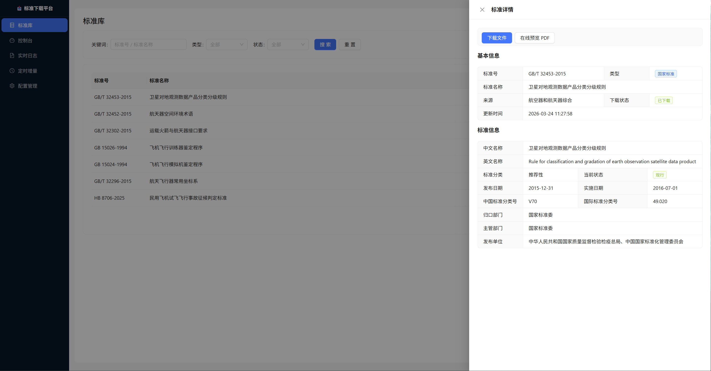
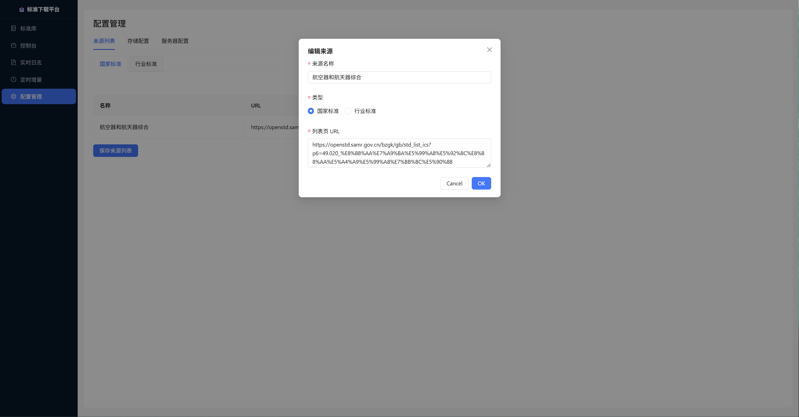

# 标准下载管理平台

自动化下载国家标准（国标）和行业标准（行标）的管理系统。基于 Playwright 实现验证码识别与自动下载，支持 OSS 存储、MySQL 持久化、实时日志推送和定时任务调度。

## 功能特性

- **双标准源支持**：国家标准（openstd.samr.gov.cn）+ 行业标准（std.samr.gov.cn）
- **验证码自动识别**：集成 ddddocr OCR，无需人工干预
- **增量断点续传**：已下载记录写入 MySQL，重启后自动跳过
- **实时日志推送**：SSE 流式推送，浏览器端实时查看下载进度
- **定时任务调度**：支持 Cron 和 Interval 两种方式，持久化到 MySQL
- **标准库检索**：全文搜索 + 在线 PDF 预览
- **灵活存储策略**：支持本地目录、OSS 或两者并存，配置文件一键切换

## 技术栈

| 层 | 技术 |
|---|---|
| 后端 | FastAPI + uvicorn + APScheduler |
| 浏览器自动化 | Playwright 1.57.0 (本地 Chromium) |
| OCR | ddddocr |
| 数据库 | MySQL + SQLAlchemy |
| 对象存储 | 自定义 OSS HTTP 接口 |
| 前端 | Vue 3 + TypeScript + Ant Design Vue |
| 构建工具 | Vite |

## 目录结构

```
standard_downloader/
├── backend/
│   ├── main.py                # FastAPI 应用入口，路由注册，lifespan
│   ├── config.py              # 配置管理（config.json + MySQL 来源）
│   ├── process_manager.py     # 子进程管理 + SSE 日志广播
│   ├── scheduler.py           # APScheduler 定时任务（Cron/Interval）
│   └── routers/
│       ├── downloaders.py     # 下载器启动/停止/状态 API
│       ├── logs.py            # SSE 实时流 + 历史日志 API
│       ├── schedule.py        # 定时任务 CRUD API
│       ├── config.py          # 配置读写 API
│       └── records.py         # 标准库检索 + 文件预览 API
├── downloaders/
│   ├── common.py              # BaseDownloader 基类 + 共用工具
│   ├── guobiao.py             # 国标下载器 + 子进程入口
│   ├── hangbiao.py            # 行标下载器 + 子进程入口
│   ├── config.py              # 子进程配置加载（storage/database）
│   ├── db.py                  # MySQL CRUD（5 张核心表）
│   └── oss_uploader.py        # OSS 文件上传
├── frontend/
│   └── src/
│       ├── App.vue            # 主布局（侧边栏导航）
│       ├── api/index.ts       # Axios API 封装
│       ├── router/index.ts    # Vue Router 路由
│       └── pages/
│           ├── RecordsPage.vue    # 标准库检索 + 在线预览
│           ├── Dashboard.vue      # 控制台（启动/停止/统计）
│           ├── LogPage.vue        # 实时日志查看
│           ├── SchedulePage.vue   # 定时任务管理
│           └── ConfigPage.vue     # 来源和服务器配置
├── sql/                       # 参考 SQL 脚本
├── logs/                      # 运行日志目录（自动创建）
├── config.json                # 主配置文件
├── requirements.txt           # Python 依赖
├── start.bat                  # Windows 一键启动
└── build_frontend.bat         # 前端构建脚本
```

## 快速开始

### 前置条件

- Python 3.9+
- Node.js 18+
- MySQL 5.7+ / 8.0+（已创建 `standard_crawler` 数据库）

### 安装步骤

**1. 安装 Python 依赖**

```bash
pip install -r requirements.txt
```

**2. 安装 Playwright Chromium**

```bash
playwright install chromium
```

**3. 配置 `config.json`**

```json
{
  "server": {
    "host": "127.0.0.1",
    "port": 8000,
    "log_dir": "logs"
  },
  "chromium_path": "",
  "storage": {
    "mode": "oss",
    "upload_url": "http://your-oss-server/file/upload",
    "save_path": "https://your-oss-domain/",
    "bucket_name": "your-bucket",
    "bucket_path": "standard"
  },
  "database": {
    "host": "127.0.0.1",
    "port": 3306,
    "db": "standard_crawler",
    "user": "root",
    "password": "your-password",
    "pool_size": 10,
    "pool_recycle": 3600
  }
}
```

> `chromium_path` 留空时，Playwright 自动使用内置 Chromium。
> `storage.mode` 可选 `"local"`（保存到本地 `download/` 目录）、`"oss"`（上传到对象存储）、`"both"`（两者并存），默认 `"oss"`。
> `storage` 未配置或 `upload_url` 为空时，跳过 OSS 上传，不影响下载。
> `database` 未配置时，不记录数据，不影响下载。

**4. 构建前端**

```bash
cd frontend
npm install
npm run build
```

**5. 启动后端**

```bash
# Windows
start.bat

# 或手动启动
python -m uvicorn backend.main:app --host 127.0.0.1 --port 8000
```

启动后访问 http://127.0.0.1:8000

### 开发模式

```bash
# 终端 1：启动后端（热重载）
python -m uvicorn backend.main:app --reload --port 8000

# 终端 2：启动前端开发服务器
cd frontend
npm run dev
# 访问 http://localhost:5173
```

## Docker 部署

### 前置条件

- Docker 1.13+
- Docker Compose 1.20+
- 宿主机已运行 MySQL 5.7+ / 8.0+

### 部署步骤

**1. 构建前端**（在有 Node.js 的机器上执行，将 `frontend/dist/` 一并上传）

```bash
cd frontend
npm install
npm run build
cd ..
```

**2. 准备配置文件**

```bash
cp config.json.example config.json
vi config.json   # 修改 database 配置
```

关键配置说明：

```json
{
  "chromium_path": "",          // 留空，容器内 Playwright 自动检测
  "database": {
    "host": "127.0.0.1",        // 容器使用 host 网络，直连宿主机 MySQL
    "port": 3306,
    "db": "standard_crawler",
    "user": "your_user",
    "password": "your_password"
  }
}
```

**3. 确认端口可用**

默认使用宿主机 **8080** 端口（前端入口），后端占用 **8000** 端口。

```bash
# 查看端口占用
ss -tlnp | grep -E '8080|8000'
```

如需更换端口，修改 `nginx/nginx.conf` 第一行：

```nginx
listen 8080;   # 改为任意空闲端口，如 9000
```

**4. 构建并启动**

```bash
docker-compose up -d --build
```

**5. 访问**

```
http://<服务器IP>:8080
```

### 常用运维命令

```bash
# 查看运行状态
docker-compose ps

# 查看后端日志
docker-compose logs -f app

# 重启后端（代码更新后）
docker-compose up -d --build app

# 仅重启 nginx（只改了 nginx.conf）
docker-compose restart nginx

# 停止所有服务
docker-compose down
```

### 端口说明

| 端口 | 服务 | 说明 |
|------|------|------|
| 8080 | nginx | 前端入口 + API 反代（可修改） |
| 8000 | FastAPI | 后端 API，仅宿主机本地访问 |

> 两个容器均使用 `network_mode: host`，直接共享宿主机网络栈，所以宿主机 MySQL 的 `127.0.0.1` 在容器内可直接访问。

---

## 界面预览

### 标准库 & 标准详情



支持按标准号 / 名称模糊搜索，筛选标准类型（国标 / 行标）和状态（现行 / 废止等）。点击任意条目右侧"详情"按钮，在右侧抽屉展示完整元数据（标准分类、发布 / 实施日期、CCS / ICS 分类号、归口部门等），并提供"下载文件"和"在线预览 PDF"操作。

### 来源配置



以国标 / 行标两个子标签分别管理来源列表；支持新增、编辑、删除，保存后立即生效。存储配置和服务器配置通过独立 Tab 管理，互不影响。

---

## 使用指南

### 来源配置详解

"来源"是本工具最核心的配置单元，每条来源对应一个标准目录的列表页，下载器会逐页遍历并下载其中的所有标准全文。


#### 字段说明

| 字段 | 必填 | 说明 |
|---|---|---|
| 来源名称 | ✓ | 任意标识字符串，用于日志、任务调度和文件归档。建议使用"行业代码-行业名称"格式，如 `NY-农业` |
| 类型 | ✓ | `国家标准`（guobiao）或 `行业标准`（hangbiao），决定使用哪套下载流程 |
| 列表页 URL | ✓ | 该来源对应的标准目录起始页 URL，详见下方说明 |

#### 国标来源 URL 获取方法

国标列表 URL 来自 **[国家标准全文公开系统](https://openstd.samr.gov.cn/bzgk/gb/)**。

**步骤：**

1. 打开 [https://openstd.samr.gov.cn/bzgk/gb/std_list](https://openstd.samr.gov.cn/bzgk/gb/std_list)
2. 在左侧导航或筛选条件中选择你需要的 ICS 分类号、状态等过滤条件
3. 触发搜索后，复制浏览器地址栏中的完整 URL 填入"列表页 URL"

**常用国标 URL 示例：**

```
# 全量（按发布日期降序）
https://openstd.samr.gov.cn/bzgk/gb/std_list?p.p1=0&p.p90=circulation_date&p.p91=desc

# ICS 49（航空器和航天器）
https://openstd.samr.gov.cn/bzgk/gb/std_list_ics?p.p1=0&p.p90=circulation_date&p.p91=desc&p.p6=49

# ICS 71（化工技术）
https://openstd.samr.gov.cn/bzgk/gb/std_list_ics?p.p1=0&p.p90=circulation_date&p.p91=desc&p.p6=71

# 仅强制性国家标准（GB）
https://openstd.samr.gov.cn/bzgk/gb/std_list?p.p1=0&p.p90=circulation_date&p.p91=desc&p.p3=1
```

> URL 中 `p.p6=49` 对应 ICS 分类号，`p.p3=1` 表示强制性标准。可在网站上筛选后直接复制地址栏 URL，不需要手动拼接参数。

#### 行标来源 URL 获取方法

行标列表 URL 来自 **[行业标准全文公开系统](https://std.samr.gov.cn/hb)**。

**步骤：**

1. 打开 [https://std.samr.gov.cn/hb/search/stdHBQueryPage](https://std.samr.gov.cn/hb/search/stdHBQueryPage)
2. 在"行业"下拉框中选择目标行业（如"NY 农业"、"HB 航空"）
3. 点击搜索后，复制地址栏完整 URL

> `industryCode` 参数即行业代码。完整的行业代码列表可在行业标准全文公开系统首页的行业下拉框中查看。

#### 常见行业代码参考

| 代码 | 行业 | 代码 | 行业 |
|---|---|---|---|
| `HB` | 航空 | `NY` | 农业 |
| `CB` | 船舶 | `JT` | 交通 |
| `YB` | 黑色冶金 | `YS` | 有色金属 |
| `SY` | 石油天然气 | `HG` | 化工 |
| `DL` | 电力 | `MT` | 煤炭 |
| `JB` | 机械 | `QB` | 轻工 |
| `FZ` | 纺织 | `YY` | 医药 |
| `WS` | 卫生 | `GY` | 广播电影电视 |

### 启动下载

1. 打开 **控制台** 页面
2. 找到对应来源，点击"启动"
3. 切换到 **实时日志** 页面，选择对应来源，查看下载进度

> 控制台手动启动为**全量模式**，会扫描所有页面直到末尾；定时任务启动为**增量模式**，遇到已下载的连续页面时自动停止。

### 设置定时任务

1. 打开 **定时增量** 页面，点击"新增任务"
2. 选择来源，配置触发方式：
   - **Cron**：指定 day_of_week（如 `mon,wed,fri`）、hour（如 `9`）、minute（如 `0`）
   - **Interval**：指定 hours / minutes 间隔
3. 保存后任务自动生效

### 检索标准库


1. 打开 **标准库** 页面
2. 支持按关键词（标准号 / 名称）、类型（国标 / 行标）、状态筛选
3. 点击条目右侧"详情"，右侧抽屉展示完整元数据：
   - 标准号、名称（中英文）、来源、下载状态
   - 发布日期、实施日期、当前状态（现行 / 废止 / 被代替）
   - CCS 中国标准分类号、ICS 国际标准分类号
   - 归口部门、主管部门、发布单位
4. 抽屉顶部提供"下载文件"（直接下载 PDF）和"在线预览 PDF"（浏览器内预览）

## API 文档

后端运行后访问 http://127.0.0.1:8000/docs 查看完整 Swagger 文档。

### 主要端点

| 端点 | 方法 | 说明 |
|---|---|---|
| `/api/downloaders` | GET | 获取所有来源及运行状态 |
| `/api/downloaders/{id}/start` | POST | 启动下载进程 |
| `/api/downloaders/{id}/stop` | POST | 停止下载进程 |
| `/api/logs/{id}/stream` | GET | SSE 实时日志流 |
| `/api/logs/{id}/history` | GET | 历史日志文件列表 |
| `/api/schedule` | GET/POST | 定时任务列表 / 创建 |
| `/api/schedule/{id}` | DELETE | 删除任务 |
| `/api/schedule/{id}/pause` | POST | 暂停任务 |
| `/api/schedule/{id}/resume` | POST | 恢复任务 |
| `/api/config` | GET/PUT | 服务器配置读写 |
| `/api/config/sources` | GET/PUT | 来源列表读写 |
| `/api/records` | GET | 标准库分页检索 |
| `/api/records/{id}` | GET | 单条记录详情 |
| `/api/records/{id}/preview` | GET | 文件预览（代理 OSS） |

### 标准检索参数

| 参数 | 说明 | 示例 |
|---|---|---|
| `keyword` | 标准号或名称模糊搜索 | `GB/T 100` |
| `source_type` | 标准类型 | `guobiao` / `hangbiao` |
| `status` | 下载状态 | `SUCCESS` / `NO_FULL_TEXT` / `ABOLISHED` / `ADOPTED` / `FAILED` |
| `page` | 页码（默认 1）| `1` |
| `page_size` | 每页数量（默认 20，最大 100）| `20` |

## 数据库设计

系统启动时自动建表，无需手动执行 SQL。

| 表名 | 说明 |
|---|---|
| `standard_download_record` | 下载记录（std_no + source_name 唯一键） |
| `download_source` | 来源配置 |
| `guobiao_detail` | 国标元数据（名称、CCS、ICS、发布日期等） |
| `hangbiao_detail` | 行标元数据（行业代码、归口单位、适用范围等） |
| `hangbiao_replace_std` | 行标被代替关联关系 |

### 下载状态说明

| 状态 | 含义 | 后续行为 |
|---|---|---|
| `SUCCESS` | 已成功下载，文件存 OSS | 增量运行时跳过 |
| `NO_FULL_TEXT` | 网站无全文 PDF | 增量运行时跳过 |
| `ABOLISHED` | 标准已废止 | 仅记录元数据，跳过下载 |
| `ADOPTED` | 被其他标准代替 | 仅记录元数据，跳过下载 |
| `FAILED` | 下载失败 | 增量运行时重试 |

## 架构说明

### 子进程通信

每个来源对应一个独立子进程（`python -m downloaders.guobiao` 或 `downloaders.hangbiao`），通过环境变量传递配置：

```
DOWNLOADER_SOURCE_NAME    来源名称
DOWNLOADER_SOURCE_URL     列表页 URL
DOWNLOADER_SOURCE_TYPE    guobiao / hangbiao
DOWNLOADER_SOURCE_ID      唯一标识，用于停止检查
DOWNLOADER_DOWNLOAD_DIR   下载目录
```

### 优雅停止机制

点击"停止"后：

1. 后端写 `logs/{source_id}.stop` 标志文件
2. 子进程每行处理前调用 `should_stop()` 检测文件
3. 检测到停止信号后，当前任务处理完毕即退出
4. 超过 5 分钟未退出则强制终止

### 下载流程（国标）

```
列表页 → 点击"查看详细"按钮
       → expect_page 等待新标签页
       → 点击"下载标准"按钮
       → 等待验证码弹窗
       → OCR 识别验证码
       → 点击"验证"按钮
       → expect_page 等待下载标签页
       → 捕获 download 事件
       → 保存文件 → 上传 OSS → 写入 MySQL
```

### 下载流程（行标）

```
列表页 → 打开详情页（直接 goto 绝对 URL）
       → 点击"查看文本"按钮
       → expect_page 等待 hbba.sacinfo.org.cn
       → 等待验证码弹窗
       → OCR 识别验证码
       → 点击"下载"按钮
       → AJAX 返回 token
       → window.location.href 触发下载
       → 捕获 download 事件
       → 保存文件 → 上传 OSS → 写入 MySQL
```

### SSE 实时日志

子进程的 `stdout` 被主进程实时捕获：

```
子进程 stdout
    → 写入日志文件 (logs/{source_id}/{date}.log)
    → 广播到所有 SSE 订阅者
        → 浏览器 EventSource 实时展示
```

## 故障排查

| 问题 | 可能原因 | 解决方法 |
|---|---|---|
| 下载进程无法启动 | Chromium 路径错误 | 检查 `config.json` 的 `chromium_path` 或执行 `playwright install chromium` |
| 验证码识别失败 | ddddocr 未安装 | `pip install ddddocr` |
| MySQL 连接失败 | 配置错误或服务未启动 | 检查 `database` 配置，确认 MySQL 运行正常 |
| 前端无法连接后端 | 端口或 CORS 问题 | 开发模式下确认后端运行在 8000 端口 |
| OSS 上传失败 | upload_url 无效 | 检查 `storage.upload_url` 配置，OSS 上传失败不影响下载主流程 |
| 停止后进程仍在运行 | 停止信号未被检测到 | 等待当前任务完成，超过 5 分钟后自动强制终止 |
| Docker 启动报端口占用 | 8080 / 8000 端口已被占用 | 修改 `nginx/nginx.conf` 中的 `listen` 端口，8000 冲突则同步修改 `docker-compose.yml` CMD 和 nginx.conf 中的 upstream |

## 配置参考

### Chromium 路径优先级

1. 环境变量 `CHROMIUM_PATH`（部署时推荐）
2. `config.json` 的 `chromium_path`（本地开发）
3. Playwright 自动检测内置 Chromium

### OSS 路径规则

```
standard/guobiao/{文件名}
standard/hangbiao/{文件名}
```

### 存储模式说明

| `storage.mode` | 本地目录 | OSS 上传 | 适用场景 |
|---|---|---|---|
| `local` | ✓ | ✗ | 内网部署、无对象存储 |
| `oss` | ✗ | ✓ | 云端部署（默认） |
| `both` | ✓ | ✓ | 需要本地备份且同步上云 |

## 依赖清单

```
playwright==1.57.0
ddddocr>=1.4.0
fastapi>=0.111.0
uvicorn[standard]>=0.29.0
apscheduler>=3.10.4
sqlalchemy>=2.0.0
PyYAML>=6.0
httpx>=0.27.0
python-multipart>=0.0.9
```

---

## 数据来源与版权声明

### 数据来源

本工具下载及输出的全部标准文件均来自以下官方公开平台：

- **国家标准全文公开系统**：[openstd.samr.gov.cn](https://openstd.samr.gov.cn/bzgk/gb/)
  由国家市场监督管理总局（SAMR）和国家标准化管理委员会（SAC）运营，依据《标准化法》面向社会提供强制性国家标准及部分推荐性国家标准的全文公开阅读与下载服务。

- **行业标准全文公开系统**：[std.samr.gov.cn/hb](https://std.samr.gov.cn/hb)
  由国家标准化管理委员会统一管理，汇聚各行业主管部门（工信部、交通部、农业农村部等）发布的行业标准，依据相关政策面向社会提供全文公开阅读与下载服务。

### 使用限制

**在使用本工具输出的任何内容之前，请仔细阅读并遵守以下规定：**

1. **遵守平台使用条款**：下载及使用标准文件须遵守上述两个官方平台各自的服务条款与使用规定。相关条款以各平台官网公布的最新版本为准。

2. **国家标准版权**：
   根据《中华人民共和国著作权法》及《国家标准管理办法》，国家标准文本依法受版权保护。国家标准化管理委员会依法对强制性国家标准和推荐性国家标准享有著作权。未经授权，不得将标准文本用于商业出版、发行或以任何形式对外销售。

3. **行业标准版权**：
   行业标准文本的版权归属相应行业主管部门或标准制定机构所有。具体版权归属及使用授权请参阅各标准文本的版权页或咨询相应归口单位。

4. **采用国际标准的版权**：
   我国采用 ISO（国际标准化组织）、IEC（国际电工委员会）及其他国际标准化机构标准而制定的国家标准（如 GB/T XXXXX-YYYY 等同采用 ISO 标准），同时受到相应国际标准版权保护。ISO/IEC 标准版权归 ISO/IEC 所有，未经授权不得复制、转售或二次分发。

5. **合理使用范围**：
   本工具仅面向有合规需求的组织内部参考、研究和学习目的。严禁将下载内容用于商业销售、大规模再发布，或任何违反原始平台服务条款的用途。

### 免责声明

本工具（standard-downloader）仅为自动化访问上述官方公开系统的辅助工具，**不存储、不托管、不分发任何标准文件本身**。
工具的作者和贡献者对因使用本工具获取的内容所引发的任何版权纠纷、法律责任或损失不承担责任。用户须自行确保其对所下载内容的使用符合相关法律法规和平台使用规定。

### 感谢

**感谢金侗千（网名181）先生对本项目进行漏洞测试**

---

## 开源许可证

本项目以 [Apache License 2.0](LICENSE) 协议开源。

```
Copyright 2025 standard-downloader contributors

Licensed under the Apache License, Version 2.0 (the "License");
you may not use this file except in compliance with the License.
You may obtain a copy of the License at

    http://www.apache.org/licenses/LICENSE-2.0

Unless required by applicable law or agreed to in writing, software
distributed under the License is distributed on an "AS IS" BASIS,
WITHOUT WARRANTIES OR CONDITIONS OF ANY KIND, either express or implied.
See the License for the specific language governing permissions and
limitations under the License.
```

> **注意**：Apache 2.0 许可证仅适用于本项目的**源代码**（工具本身），不授予对任何通过本工具下载的标准文件内容的任何权利。标准文件的版权归其原始权利人所有，须单独遵守其适用的版权规定（详见上方"数据来源与版权声明"）。
